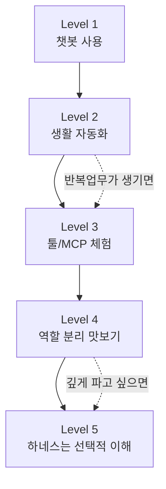
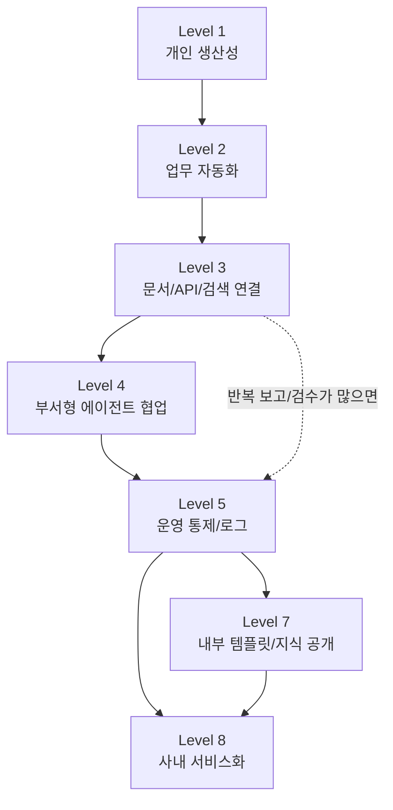
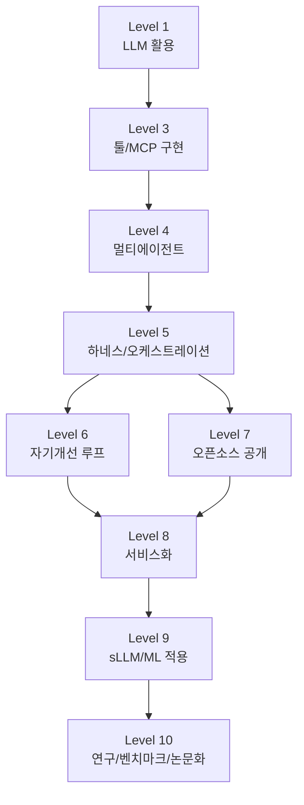
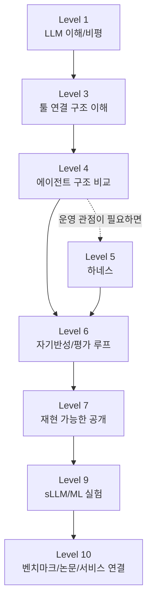
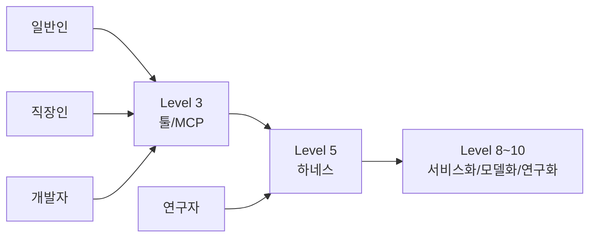

# 인공지능 완성형 활용단계 소개 가이드

> 도구 사용을 넘어, 에이전트 문명으로 가는 10단계

이 저장소는 단순한 링크 모음이 아닙니다.
이것은 **일반인, 실무자, 창업자, 연구자**가 AI를 어떻게 단계적으로 익히고,
각 단계의 한계를 몸으로 느끼며,
**왜 다음 단계가 필요한지 자연스럽게 이해하도록 설계된 공개 학습 지도**입니다.

우리의 목표는 하나입니다.

> 사용자가 레벨별로 직접 한 번씩 연습해보면서,
> 현재 단계의 불편을 느끼고,
> 그 불편을 해소하는 다음 단계의 필요성을 이해하며,
> 점진적으로 사고를 확장해 나가도록 만드는 것.

---

## 이 리포가 풀고자 하는 문제

오늘날 많은 사람이 “AI를 쓴다”고 말하지만,
실제로는 완전히 다른 층위를 섞어서 이야기합니다.

- 어떤 사람은 챗봇에게 질문하는 수준이고
- 어떤 사람은 n8n으로 여러 서비스를 자동화하는 수준이며
- 어떤 사람은 파일/웹/API를 다루는 툴형 에이전트를 사용하고
- 어떤 사람은 멀티 에이전트 팀을 설계하고
- 어떤 사람은 하네스 기반 운영 체계를 만들고
- 어떤 사람은 자기개선 루프, 오픈소스, 서비스화, sLLM, 논문과 벤치마크까지 연결합니다

문제는 이것들이 전부 **“AI 활용”** 이라는 말로 뭉개진다는 점입니다.

그래서 이 리포는 다음을 제공합니다.

1. **10단계 성숙도 지도**
2. **레벨별 대표 불편과 다음 단계 필요성**
3. **레벨별 공개 리포지토리 큐레이션**
4. **직접 해볼 수 있는 실습 중심 학습 경로**
5. **GitHub Pages로 확장 가능한 공개형 구조**

---

## 이 리포의 철학

이 문서는 단순 툴 모음이 아닙니다.

- **연구자처럼** 근거와 출처를 붙이고
- **철학자처럼** 각 단계의 의미를 묻고
- **실험가처럼** 바로 시도할 수 있게 구성합니다

핵심 질문은 하나입니다.

> AI를 “사용하는 사람”에서
> AI 시스템을 설계하고 사업화하는 사람으로
> 어떻게 이동할 것인가?

그리고 더 구체적으로는 이렇게 묻습니다.

> “지금 내가 겪는 작은 불편 하나는 무엇이고,
> 그 불편을 해결하려면 왜 다음 단계가 필요한가?”

즉, 이 리포는 정답집이 아니라
**사고 확장 훈련용 계단**입니다.

---

## 누구를 위한 리포인가

### 1) 일반인
- AI를 써보고는 싶지만 어디서부터 시작할지 모르는 사람
- 챗봇은 써봤지만 그다음이 막막한 사람
- “왜 MCP, 에이전트, 하네스가 필요한지” 감이 없는 사람

### 2) 실무자
- 반복 업무를 줄이고 싶은 사람
- 자동화와 AI를 업무 흐름에 붙이고 싶은 사람
- 도구 연결에서 에이전트 구조로 넘어가고 싶은 사람

### 3) 창업자
- 챗봇 사용을 넘어 서비스 구조로 만들고 싶은 사람
- 멀티 에이전트와 하네스를 사업 시스템으로 보고 싶은 사람
- 오픈소스, 서비스화, sLLM까지 단계적으로 확장하고 싶은 사람

### 4) 연구자
- 논문/오픈소스/벤치마크/서비스의 연결 구조를 보고 싶은 사람
- 실용 기술과 이론 사이를 메우는 분류 체계가 필요한 사람

---

## 이 리포의 핵심 방법론

이 리포는 각 레벨을 이렇게 소개합니다.

- **정의**: 이 단계는 무엇인가?
- **할 수 있는 것**: 여기서 가능한 실질적 능력은 무엇인가?
- **대표 불편**: 이 단계의 한계는 무엇인가?
- **다음 단계 필요성**: 왜 다음 단계로 가야 하는가?
- **추천 공개 리포**: 무엇을 보면 좋은가?
- **실습 포인트**: 직접 뭘 해봐야 하는가?

핵심은 “좋은 자료를 많이 모으는 것”이 아닙니다.

핵심은:

> **좋은 자료를 올바른 순서로 재배열해서,
> 사용자가 과부하 없이 한 단계씩 성장하도록 돕는 것**

입니다.

즉, 우리의 가치는 새로운 지식 자체보다,
**정렬, 순서, 맥락, 체험 설계**에 있습니다.

---

## 10단계 개요

1. **챗봇 수준**
2. **다중 챗봇 연결 / n8n 자동화 수준**
3. **스킬·플러그인·MCP 수준**
4. **서브 에이전트 팀 수준**
5. **에이전트 하네스 수준**
6. **에이전트 오로보로스(자기개선 루프) 수준**
7. **오픈소스 공개 수준**
8. **Generate as a Service 수준**
9. **sLLM / ML 직접 구현 및 서비스 적용 수준**
10. **Full LLM / 벤치마크 / 논문 / 서비스 통합 수준**

---

## 왜 이 10단계 구조가 중요한가

사람은 보통 다음과 같이 배웁니다.

1. “오, 이거 신기하네.”
2. “근데 여기서 좀 불편하네.”
3. “아, 그래서 다음 단계가 필요한 거구나.”

이 리포는 바로 이 학습 메커니즘을 노립니다.

예를 들면:

- **Level 1 불편**: 매번 직접 질문해야 한다
  - → 그래서 **Level 2 자동화**가 필요하다
- **Level 2 불편**: 연결은 되지만 AI가 스스로 행동하진 못한다
  - → 그래서 **Level 3 MCP/툴**이 필요하다
- **Level 3 불편**: 툴은 쓰지만 한 명짜리 고급 비서에 가깝다
  - → 그래서 **Level 4 서브 에이전트 팀**이 필요하다
- **Level 4 불편**: 팀은 생겼지만 운영 체계가 없다
  - → 그래서 **Level 5 하네스**가 필요하다
- **Level 5 불편**: 통제는 되지만 스스로 배우지는 못한다
  - → 그래서 **Level 6 자기개선 루프**가 필요하다

이런 식으로 사용자는 단계를 외우는 것이 아니라,
**불편의 진화를 통해 구조를 체감**하게 됩니다.

---

## 특히 중요한 전환점: Level 5 하네스

이 리포가 강조하는 가장 중요한 분기점은 **5단계**입니다.

4단계가 “에이전트 팀이 있다”는 뜻이라면,
5단계는 “그 팀을 **재현 가능하게 운영하는 체계**가 있다”는 뜻입니다.

여기서 중요한 것은:
- 상태 관리
- 입출력 규격
- 로그
- 실패 추적
- 재시도
- 가드레일
- 평가 루프

즉,
**창업자 수준이라면 에이전트를 단순히 쓰는 것에서 끝나지 않고,
하네스로 운영할 줄 알아야 한다**는 관점을 이 리포의 중심축으로 둡니다.

관련 대표 참고:
- harness-100: <https://github.com/revfactory/harness-100>

---

## 레벨별 추천 공개 리포 큐레이션 방향

이 리포는 단순히 awesome 리스트를 다시 링크하는 데서 끝나지 않습니다.

목표는 다음과 같습니다.

- **Level 1**에서는 너무 많은 정보를 주지 않는다
- **각 레벨마다 핵심 리포 몇 개만 먼저 제시한다**
- “이 리포 전체를 다 보라”가 아니라
  - “이 레벨에서는 이 리포의 어떤 성격을 참고하라”로 안내한다
- 실습을 먼저 하고,
  그 뒤에 더 넓은 참고자료로 나아가게 한다

현재 주요 큐레이션 축은 다음과 같습니다.

### Level 1 — 챗봇/LLM 입문
- <https://github.com/Shubhamsaboo/awesome-llm-apps>
- <https://github.com/Hannibal046/Awesome-LLM>
- <https://github.com/WangRongsheng/awesome-LLM-resources>

### Level 2 — 자동화 / n8n
- <https://github.com/n8n-io/n8n>
- <https://github.com/n8n-io/n8n-docs>
- <https://github.com/enescingoz/awesome-n8n-templates>
- <https://github.com/lucaswalter/n8n-ai-automations>

### Level 3 — 스킬 / 플러그인 / MCP
- <https://github.com/modelcontextprotocol>
- <https://github.com/modelcontextprotocol/modelcontextprotocol>
- <https://github.com/wong2/awesome-mcp-servers>
- <https://github.com/appcypher/awesome-mcp-servers>
- <https://github.com/lastmile-ai/mcp-agent>

### Level 4 — 서브 에이전트 팀
- <https://github.com/microsoft/autogen>
- <https://github.com/crewAIInc/crewAI>
- <https://github.com/crewAIInc/crewAI-examples>
- <https://github.com/langchain-ai/langgraph>
- <https://github.com/e2b-dev/awesome-ai-agents>
- <https://github.com/mergisi/awesome-openclaw-agents>

### Level 5 — 에이전트 하네스
- <https://github.com/revfactory/harness-100>
- <https://github.com/langchain-ai/langgraph>
- <https://github.com/lastmile-ai/mcp-agent>

### Level 6 — 자기개선 루프
- Reflexion: <https://arxiv.org/abs/2303.11366>
- Generative Agents: <https://arxiv.org/abs/2304.03442>

### Level 7 — 오픈소스 공개
- awesome 리포들, 오픈 에이전트 프레임워크, 템플릿 리포들을 공개 사례로 연결

### Level 8 — Generate as a Service
- <https://github.com/Shubhamsaboo/awesome-llm-apps>
- <https://github.com/Arindam200/awesome-ai-apps>
- <https://github.com/lucaswalter/n8n-ai-automations>

### Level 9 — sLLM / ML
- <https://github.com/jzhang38/TinyLlama>
- <https://github.com/artidoro/qlora>
- <https://github.com/HqWu-HITCS/Awesome-Chinese-LLM>
- <https://github.com/tensorchord/Awesome-LLMOps>

### Level 10 — Full LLM / 연구/벤치마크
- LLaMA paper: <https://arxiv.org/abs/2302.13971>
- Meta Llama: <https://ai.meta.com/llama/>
- Mistral: <https://github.com/mistralai>
- Transformer 원전: <https://arxiv.org/abs/1706.03762>

---

## 트랙별 학습 경로

아래 경로는 GitHub에서 바로 보이는 **Mermaid 그래프**로 정리했습니다.
복잡한 현실을 완벽히 모델링하려는 것이 아니라,
**가장 의미 있는 분기와 병합**만 남겨서 빠르게 길을 잡도록 돕는 것이 목적입니다.

### 1) 일반인 트랙

**설명**
- 일반인은 1→2→3까지만 와도 큰 체감이 납니다.
- 4단계는 “AI 팀처럼 일하는 구조”를 맛보는 수준으로 두고,
- 5단계는 필수가 아니라 **호기심 있는 사용자를 위한 확장 경로**로 둡니다.

### 2) 직장인 트랙

**설명**
- 직장인은 2단계와 3단계에서 가장 큰 ROI를 얻습니다.
- 하지만 실제 조직 도입까지 가려면 5단계의 **로그·승인·재현성**이 매우 중요합니다.
- 이후에는 대외 오픈소스가 아니라도, 사내 공개/템플릿화(7단계의 내부 버전)를 거쳐 8단계로 갈 수 있습니다.

### 3) 개발자 트랙

**설명**
- 개발자는 2단계를 건너뛰고 3단계로 바로 들어가도 됩니다.
- 핵심 분기점은 5단계입니다.
- 5단계 이후엔 **자기개선(6)** 과 **오픈소스 공개(7)** 가 나란히 중요하고,
  둘 다 결국 서비스화(8)와 기술 심화(9~10)로 이어집니다.

### 4) 연구자 트랙

**설명**
- 연구자는 2단계 자동화보다 **구조 비교와 평가 문제**가 더 중요할 수 있습니다.
- 그래서 3→4→6→7→9→10의 흐름이 자연스럽습니다.
- 다만 실험의 재현성과 운영 구조를 보려면 5단계 하네스를 반드시 한 번은 거쳐야 합니다.

### 트랙 간 공통 병합점

**핵심 메시지**
- 대부분의 경로는 결국 **Level 3**에서 한 번 만나고,
- 진짜 구조적 전환은 **Level 5 하네스**에서 일어나며,
- 이후엔 서비스화(8), 모델화(9), 연구화(10)로 갈라집니다.

---

## 빠른 시작: 처음 온 사람은 이렇게 보세요

### Step 1. 나는 AI를 어디까지 써봤는가?
- 챗봇과 대화만 해봤다 → Level 1
- 자동화 툴에 붙여봤다 → Level 2
- 파일/웹/API를 연결하는 AI를 다뤄봤다 → Level 3
- 역할 분리된 에이전트를 써봤다 → Level 4
- 로그/상태/재시도까지 운영해봤다 → Level 5+

### Step 2. 하나만 해본다
한 번에 다 하지 말고,
**자기 수준에서 딱 한 단계만 실습**해보는 것이 중요합니다.

### Step 3. 불편을 기록한다
실습 후 아래 질문에 답해보세요.
- 무엇이 편했는가?
- 무엇이 답답했는가?
- 사람 손이 어디서 많이 들어갔는가?
- 왜 다음 단계가 필요한가?

이 질문이 곧 다음 학습 단계로 넘어가는 문입니다.

---

## 문서 구조

- **처음 보는 사람**: `docs/guide.ko.md`
- **영문 독자**: `docs/guide.en.md`
- **레벨별 실습 로드맵**: `docs/levels.ko.md`
- **실습 체크리스트**: `docs/checklist.ko.md`
- **오픈소스/논문 맵**: `docs/sources.md`
- **언어별 번역 진입점**: `docs/LANGUAGES.md`

---

## GitHub Pages 비전

이 저장소는 앞으로 GitHub Pages 기반 공개 학습 사이트로 확장될 수 있습니다.

우리가 지향하는 구조는 다음과 같습니다.

### 홈
- “나는 지금 몇 단계인가?”
- 일반인 / 창업자 / 연구자 진입 버튼
- 10단계 전체 지도

### 레벨 맵
- 1~10단계 카드형 시각화
- 각 단계별 핵심 불편 1문장
- 다음 단계 필요성 1문장

### 각 레벨 상세 페이지
- 정의
- 왜 필요한가
- 현재 단계의 불편
- 다음 단계의 필요성
- 추천 공개 리포 3~5개
- 1시간 실습 미션
- 실습 후 자기 점검 질문

### 마지막 페이지
- 일반인용 성장 경로
- 창업자용 성장 경로
- 연구자용 성장 경로

즉, 최종적으로는 이 리포를 통해 사용자가
**읽고 끝나는 것이 아니라, 직접 따라 하며 성장하는 공개형 학습 사이트**를 만드는 것이 목표입니다.

---

## 언어 정책

메인은 한국어이며, 영어를 우선 보조 언어로 둡니다.
그 외 언어는 글로벌 접근성과 사용자 저변을 고려하여 순차적으로 확장합니다.

현재 확장 대상으로 잡은 언어는 다음과 같습니다.

1. 한국어 (메인)
2. English
3. 中文
4. हिन्दी
5. Español
6. Français
7. العربية
8. বাংলা
9. Português
10. Русский

관련 진입점: `docs/LANGUAGES.md`

---

## 이 리포가 지향하는 최종 메시지

이 리포는 단순히 “요즘 AI 뭐가 좋다”를 말하려는 것이 아닙니다.

이 리포가 궁극적으로 말하고 싶은 것은 이것입니다.

> 인공지능 완성형 활용이란,
> 챗봇을 잘 쓰는 데서 끝나는 것이 아니라,
> 자동화, 도구 연결, 멀티 에이전트, 하네스, 자기개선,
> 오픈소스, 서비스화, 모델 구현, 연구와 벤치마크까지
> 점진적으로 연결되는 하나의 지적·실천적 계단을 오르는 일이다.

---

## 기여 방법

다음과 같은 기여를 환영합니다.

- 번역 기여
- 레벨별 실습 미션 제안
- 실제 사례 / 실패 사례 공유
- 오픈소스 / 논문 링크 보강
- GitHub Pages 구조 개선
- 초심자 친화적 튜토리얼 개선

PR과 Issue를 환영합니다.

---

## 시작하기

가장 쉬운 시작점은 아래 둘 중 하나입니다.

1. `docs/guide.ko.md` 를 읽고 전체 구조를 파악한다
2. `docs/levels.ko.md` 로 가서 현재 내 레벨에 맞는 공개 리포 하나를 직접 써본다

읽는 것보다,
**작게라도 직접 해보는 것**이 더 중요합니다.
